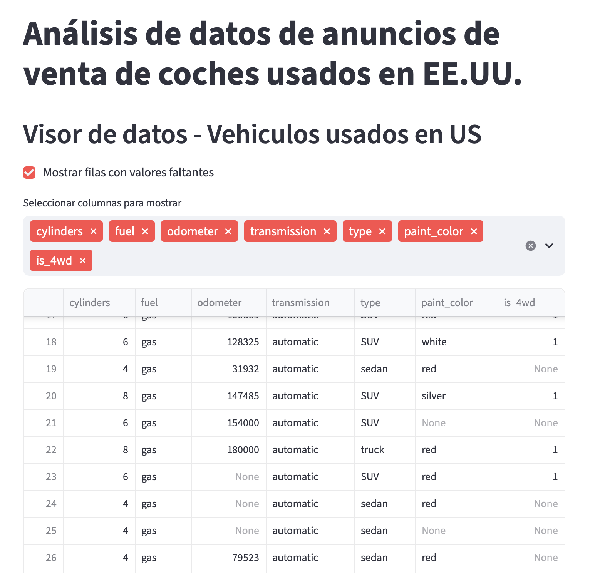
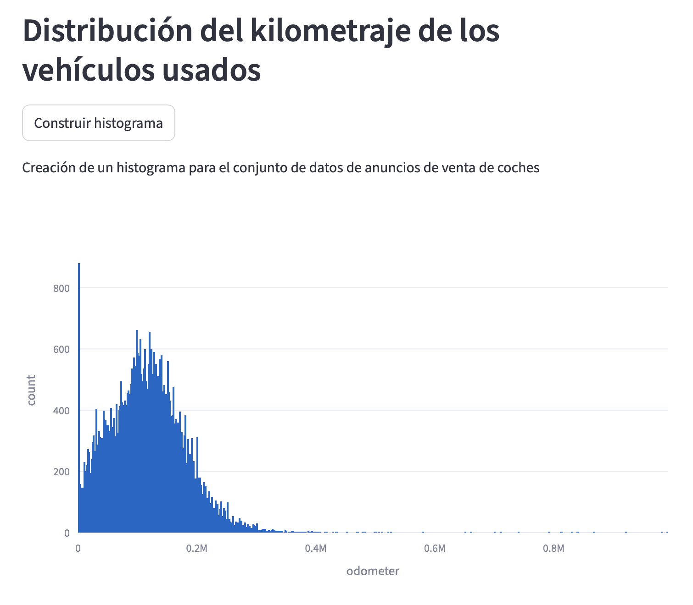
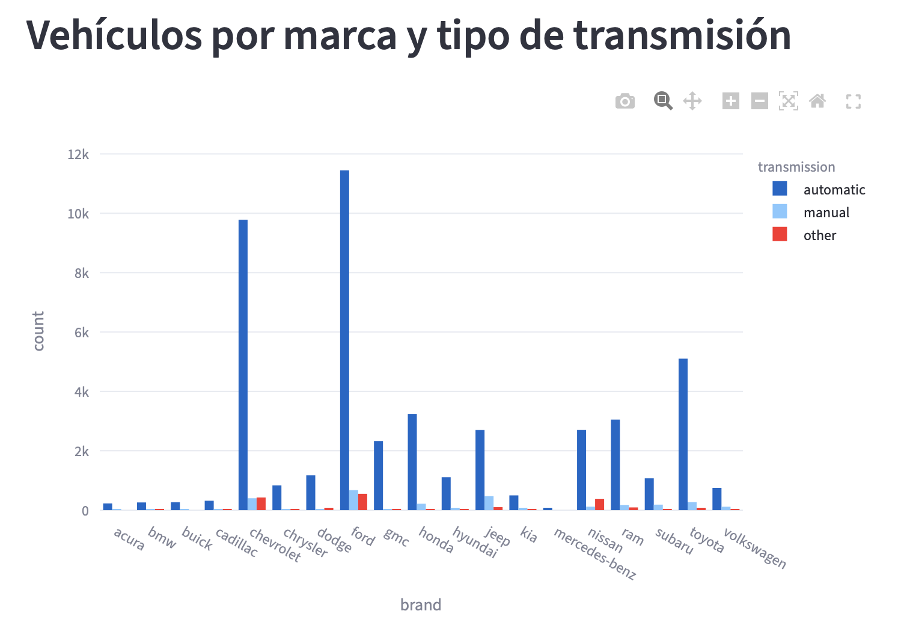

# Analista Administrativa en transición a Data Analytics
Analizo información para explicar comportamientos y apoyar decisiones de negocio.

---

## Sobre mí

Soy profesional en Administración de Negocios y Economía con experiencia en procesos administrativos y de recursos humanos, especialmente en nómina y control de información.

Actualmente me encuentro en formación en análisis de datos, aplicando SQL, Python, Excel y Power BI para limpiar datos, analizarlos y convertirlos en reportes claros orientados a negocio.

Me interesa desarrollarme en analítica operativa y People Analytics: comprender qué ocurre en los procesos y cómo mejorarlos a partir de información.

---

## Habilidades técnicas

**Lenguajes y consulta de datos**  
Python (pandas, limpieza y análisis exploratorio) · SQL (consultas, joins, agregaciones)

**Análisis**  
Limpieza de datos · EDA · métricas de negocio · segmentación · validación de hipótesis

**Visualización**  
Power BI · Matplotlib · Seaborn · Storytelling con datos

**Herramientas**  
Excel · Git/GitHub · Jupyter Notebook

---

## Habilidades analíticas

Pensamiento analítico · Resolución de problemas · Interpretación de resultados · Comunicación de hallazgos · Enfoque en negocio y procesos

---

# Proyectos

---

## Explorador interactivo de anuncios de vehículos usados

Aplicación interactiva para explorar patrones de precios y características de vehículos usados sin necesidad de conocimientos técnicos.

**Problema**  
El mercado de autos usados contiene gran cantidad de anuncios con información dispersa, lo que dificulta identificar patrones de precio y características relevantes sin análisis manual.

**Objetivo**  
Construir una herramienta visual que permita analizar y comprender los datos de forma intuitiva mediante filtros y visualizaciones dinámicas.

**¿Qué hice?**
- Limpieza y preparación de datos con Python y pandas
- Análisis exploratorio (EDA)
- Desarrollo de aplicación interactiva con Streamlit
- Visualizaciones dinámicas con Plotly

**Ejemplos de análisis**

El kilometraje presenta una distribución sesgada hacia valores bajos, concentrando la mayor cantidad de vehículos por debajo de 200.000 km.

La transmisión automática domina la mayoría de marcas, mientras la manual aparece en segmentos específicos del mercado.

**Resultado**
Herramienta que permite explorar datos, detectar patrones y comparar características de vehículos de manera visual e inmediata.

**Aprendizaje**
Transformar un dataset crudo en una herramienta usable para usuarios no técnicos, priorizando claridad y exploración autónoma.

**Herramientas**
Python · Pandas · Streamlit · Plotly

[🔎 Ver aplicación del proyecto](https://proyecto-sprint-7-mdar.onrender.com)

[💻 Repositorio del proyecto](https://github.com/bteana/Proyecto_sprint_7.git)

---

## Contacto

[LinkedIn](https://www.linkedin.com/in/anaebustamante/)  
[GitHub](https://github.com/bteana)
